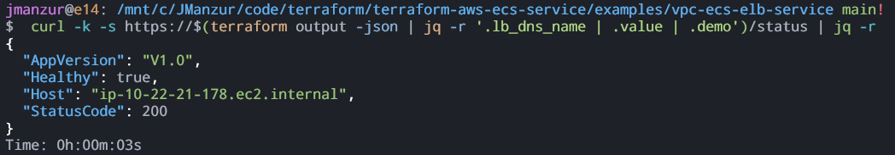

# Example VPC ECS ELB Service

This example creates a VPC with public and private subnets, an ECS Fargate cluster, an deploy an ECS service with an Application Load Balancer.

## Solution Diagram


## How to Deploy

Perform the following steps to deploy the example:

Create a `terraform.tfvars` file with the following content:
```hcl
aws_profile = "YOUR_AWS_PROFILE"
```

Initialize the Terraform working directory:
```bash
terraform init --upgrade
```

Deploy the infrastructure:
```bash
terafform apply --auto-approve
```

## How to Test

From the output of the Terraform deployment, get the `lb_dns_name` and access the URL in a web browser. You should see a web application like the following:


Notice that every time you refresh the page, the application will show diferent hostname, which is the container ID of the ECS service.

You can also use the following `curl` command to test the application:

```bash
curl -k -s https://<lb_dns_name>/status
```

> 💡PRO TIP: Get the `lb_dns_name` from the Terraform output.
> - [jq](https://jqlang.github.io/jq/download/) required to parse the JSON output.


```bash
curl -k -s https://$(terraform output -json | jq -r '.lb_dns_name | .value | .demo')/status | jq -r
```


## Clean Up

To clean up the resources, run the following command:

```bash
terraform destroy --auto-approve
```

## Troubleshooting Tips

### Accessing the ECS Container:

```bash
AWS_REGION=us-east-1
AWS_PROFILE=YOUR_AWS_PROFILE
ECS_CLUSTER=jm-poc-fargate-cluster
TASK_FAMILY=images-uploader
CONTAINER_NAME=images-uploader
TASK_ID=$(aws ecs list-tasks --cluster $ECS_CLUSTER --family $TASK_FAMILY --region $AWS_REGION --profile $AWS_PROFILE | jq -r '.taskArns | .[0]')

aws ecs execute-command --cluster $ECS_CLUSTER --task $TASK_ID --container $CONTAINER_NAME --command "/bin/bash" --interactive --region $AWS_REGION --profile $AWS_PROFILE
```

If you get the following error:

> We couldn't start the session because encryption is not set up on the selected CloudWatch Logs log group. Either encrypt the log group or choose an option to enable logging without encryption.

Try to update the cluster configuration to disable the CloudWatch encryption:

```bash
CLUSTER_NAME="jm-poc-fargate-cluster"
LOG_GROUP_NAME="/aws/ecs/jm-poc/ecs-execute-command"
aws ecs update-cluster --cluster $CLUSTER_NAME --configuration '{
  "executeCommandConfiguration": {
    "logging": "OVERRIDE",
    "logConfiguration": {
      "cloudWatchLogGroupName": "'$LOG_GROUP_NAME'",
      "cloudWatchEncryptionEnabled": false
    }
  }
}'
```
