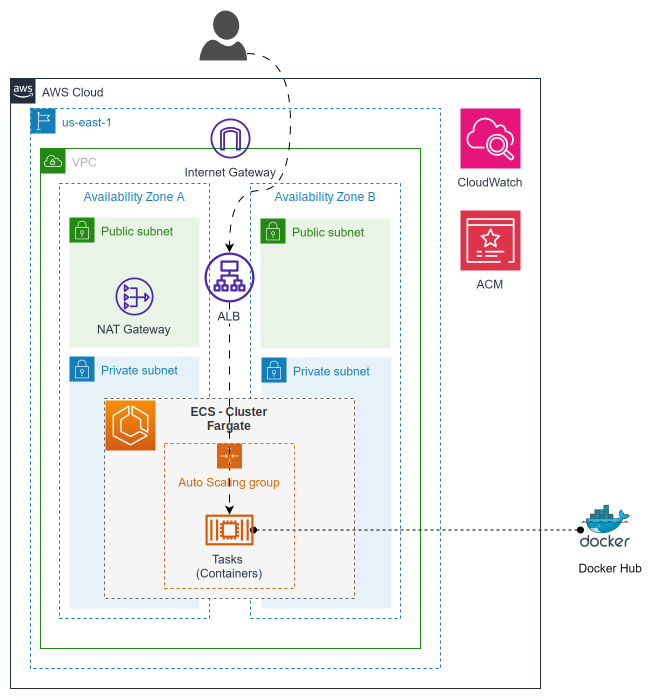

# Example VPC ECS ELB Service

This example creates a VPC with public and private subnets, an ECS Fargate cluster, an deploy an ECS service with an Application Load Balancer.

## Solution Diagram



## Troubleshooting Tips

### Accessing the ECS Container:

```bash
AWS_REGION=us-east-1
AWS_PROFILE=YOUR_AWS_PROFILE
ECS_CLUSTER=jm-poc-fargate-cluster
TASK_FAMILY=images-uploader
CONTAINER_NAME=images-uploader
TASK_ID=$(aws ecs list-tasks --cluster $ECS_CLUSTER --family $TASK_FAMILY --region $AWS_REGION --profile $AWS_PROFILE | jq -r '.taskArns | .[0]')

aws ecs execute-command --cluster $ECS_CLUSTER --task $TASK_ID --container $CONTAINER_NAME --command "/bin/bash" --interactive --region $AWS_REGION --profile $AWS_PROFILE
```

If you get the following error:

> We couldn't start the session because encryption is not set up on the selected CloudWatch Logs log group. Either encrypt the log group or choose an option to enable logging without encryption.

Try to update the cluster configuration to disable the CloudWatch encryption:

```bash
CLUSTER_NAME="jm-poc-fargate-cluster"
LOG_GROUP_NAME="/aws/ecs/jm-poc/ecs-execute-command"
aws ecs update-cluster --cluster $CLUSTER_NAME --configuration '{
  "executeCommandConfiguration": {
    "logging": "OVERRIDE",
    "logConfiguration": {
      "cloudWatchLogGroupName": "'$LOG_GROUP_NAME'",
      "cloudWatchEncryptionEnabled": false
    }
  }
}'
```
